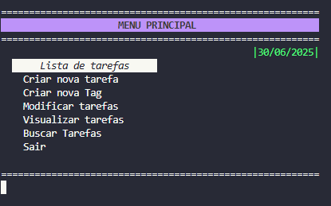
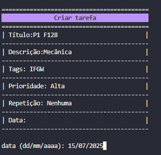
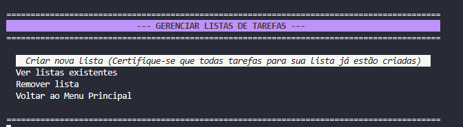
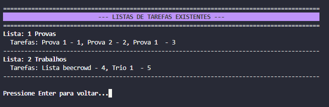

# Projeto 03 (Trabalho da disciplina de MC102)

# Nomes                         RA
# Bruno Antonio Tretto        268060
# Gabriel Dias Bastos         257756
# João Gabriel Lopes Barros   258283
# Leonardo Dias               267723

                                                              Manual do Usuário - Gerenciador de Tarefas

Bem-vindo ao seu novo Gerenciador de Tarefas! 

**1.Navegação Básica**
Toda a navegação dentro do programa é feita pelo teclado.
Use as setas para CIMA e para BAIXO para mover o seletor (a linha sublinhada) entre as opções.
Pressione a tecla ENTER para confirmar sua escolha.

**2. Funções Principais**
2.1. Criando uma Nova Tarefa
Esta função permite adicionar uma tarefa detalhada ao seu sistema.
No Menu Principal, navegue até "Criar nova tarefa" e pressione ENTER.
Uma tela de criação será exibida. Você preencherá os campos um a um:

_Título_: Digite o nome da sua tarefa e pressione ENTER.
_Descrição_: Dê um breve detalhe sobre a tarefa. Pressione ENTER.
_Tags_: Uma lista de tags existentes será exibida(você deverá ter as criado primeiro). Digite o NÚMERO da tag desejada e pressione ENTER.
_Prioridade_: Escolha o nível de prioridade digitando o NÚMERO correspondente (1 para Baixa, 2 para Média, 3 para Alta).
_Repetição_: Escolha a frequência com que a tarefa se repete, digitando o NÚMERO da opção.
_Data_: Digite a data de conclusão.

**2.2. Gerenciando Listas de Tarefas**
As listas servem para agrupar várias tarefas sob um mesmo tópico (ex: "Provas", "Trabalhos").
No Menu Principal, escolha "Lista de tarefas". Você entrará no menu de gerenciamento de listas.

Você poderá criar uma Nova Lista, ver as listas existentes ou remover uma lista;

**2.3. Criando uma Nova Tag**
Tags são etiquetas que ajudam a categorizar suas tarefas (ex: "IFGW", "IMECC", "IC").
No Menu Principal, escolha "Criar nova Tag".
Digite o nome da nova tag que você deseja criar (ex: "IFGW") e pressione ENTER.

**2.4. Visualizando Suas Tarefas (Guia Completo)**
Esta funcionalidade permite que você veja suas tarefas de várias maneiras diferentes.
No Menu Principal, escolha "Visualizar tarefas".
Você tem 3 opções iniciais para escolher:

[1] Visualizar todas as tarefas.
[2] Visualizar tarefas de uma tag.
[3] Visualizar tarefas de uma lista.

Após sua primeira escolha, uma segunda restrição pode ser aplicada:
Ver todas (dentro da sua seleção inicial).
Ver apenas as não concluídas.
Ver apenas tarefas com data até hoje.
Ver apenas tarefas com data para os próximos 7 dias.

Por fim, você escolherá a ordem em que as tarefas serão exibidas:
[1] Ordenar por data: As tarefas com data mais próxima aparecem primeiro.
[2] Ordenar por prioridade: Tarefas de prioridade "Alta" aparecem antes das de "Média" e "Baixa".
[3] Visualizar tarefas de uma lista.

**2.5. Buscando uma Tarefa**
Se você precisa encontrar uma tarefa específica rapidamente.
No Menu Principal, escolha "Buscar Tarefas", Digite uma parte do nome da tarefa que você procura e pressione ENTER.

**2.6. Sair do Programa**
Para fechar o gerenciador de tarefas de forma segura:
No Menu Principal, navegue até a opção "Sair".

